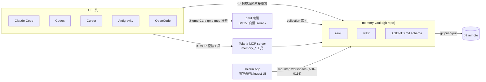

# LLM Wiki 跨工具記憶系統重構計畫

> 日期：2026-06-12
> 狀態：草案（待使用者確認關鍵決策後動工）
> 參考：[Karpathy LLM Wiki gist](https://gist.github.com/karpathy/442a6bf555914893e9891c11519de94f)、[tobi/qmd](https://github.com/tobi/qmd)

---

## 📋 目標

把 Tolaria 從「單純筆記應用」擴展為「**跨 AI 工具共用記憶系統的原生前端**」：

1. 支援 Karpathy LLM Wiki 架構：`raw/`（不可變原始來源）+ `wiki/`（LLM 維護的知識頁）+ schema（`AGENTS.md`）
2. 記憶本體是**純 Markdown 的 git repo**——任何裝置、任何 AI 工具（Claude Code、Codex、Cursor、Antigravity、OpenCode）都能直接讀寫
3. 以 **qmd**（BM25 + 向量 + LLM rerank 混合檢索）作為記憶召回引擎，AI 工具透過 qmd CLI/MCP 快速找到相關記憶
4. 使用者可在 Tolaria 內瀏覽/編輯 wiki 頁，或把新知識 Markdown 丟進 `raw/`，由 LLM ingest 流程索引進 wiki
5. 同步沿用現有 git auto-sync——跨裝置、跨工具天然一致

## 🎯 核心洞察：為什麼這個專案特別適合

現況盤點（探索結論）顯示 Tolaria 已具備 80% 的地基：

| LLM Wiki 需求 | Tolaria 現有能力 | 出處 |
|---|---|---|
| Markdown + frontmatter + wikilinks | 完整支援，動態關係偵測 | ADR-0010、`src-tauri/src/vault/parsing.rs` |
| git 同步 | auto-sync、衝突解析、divergence 復原 | `src/hooks/useAutoSync.ts`、`src-tauri/src/git/` |
| 記憶庫與一般 vault 並存 | mounted workspaces 統一圖譜 | ADR-0114、`vaults.json` |
| AI 工具讀寫介面 | MCP server（stdio + WS），自動註冊到 Claude/Cursor/Gemini/OpenCode | ADR-0011、ADR-0119、`mcp-server/` |
| LLM 維護 wiki 的執行者 | CLI agent 整合（Claude Code/Codex/OpenCode/Pi/Gemini/Kiro） | ADR-0028、`src-tauri/src/cli_agent_runtime.rs` |

**真正缺的只有三塊**：記憶庫結構協議（scaffold + schema）、qmd 檢索層、ingest/lint 工作流的 UI 化。

## ⚠️ 歷史教訓：ADR-0009 移除過 QMD

本專案曾以 qmd 做語義索引，後於 ADR-0009（2026-03-24）整個移除。當時痛點：

- **綁定 binary**：`tools/qmd/` 打包進 app → Apple code-signing / notarization 地獄（見 commit `e7f43d5d`、`049b4a9d`）
- **auto-install 邏輯**與 fresh-install 失敗模式
- vault 開啟時的索引延遲與 status bar 進度追蹤複雜度

**結論：痛點全部來自「綁定與代管」，而非 qmd 本身。** 新設計改採 **外部 CLI 依賴模式**——與 Claude Code/Codex 等 CLI agent 完全相同的地位（ADR-0028 模式）：

- 使用者自行 `npm install -g @tobilu/qmd`（或 Tolaria 提供一鍵指引）
- Tolaria 只做「偵測可用性 → 有則增強、無則退回」，不綁定、不簽章、不代管安裝
- 索引由 qmd 自己的 SQLite（`~/.cache/qmd/`）管理，不進 vault、不進 app bundle
- 需要新 ADR 部分取代 ADR-0009（保留關鍵字搜尋為基線，新增 qmd 為選配增強）

## 🏗️ 目標架構

### 記憶庫（Memory Vault）結構

獨立 git repo（建議，待確認），由 Tolaria scaffold 產生：

```
memory-vault/                  # 獨立 git repo，跨裝置靠 git remote 同步
├── raw/                       # 第一層：不可變原始來源（LLM 只讀不改）
│   ├── inbox/                 # 使用者/AI 丟入待 ingest 的新素材
│   └── assets/                # 圖片等附件
├── wiki/                      # 第二層：LLM 生成與維護的知識頁
│   ├── index.md               # 內容目錄（每頁一行摘要）——LLM 查詢的第一入口
│   ├── log.md                 # append-only 活動紀錄（## [日期] ingest | 標題）
│   ├── overview.md            # 全域綜述頁
│   └── <topic>.md             # 實體頁/概念頁：frontmatter + [[wikilinks]] + 引用 raw 來源
├── AGENTS.md                  # 第三層 schema：ingest/query/lint 協議（所有 AI 工具讀這份）
└── CLAUDE.md                  # @AGENTS.md 相容墊片（與本 repo 同模式）
```

### 三條 AI 工具存取路徑



- **路徑①（零依賴底線）**：工具直接照 `AGENTS.md` schema 讀 `wiki/index.md` → 跳轉相關頁。Karpathy 原始設計，~100k token 規模內不需任何檢索引擎
- **路徑②（規模化檢索）**：`qmd query "..."` 或 `qmd mcp`。qmd collection 註冊 memory vault，`update-cmd` 設 `git pull --rebase` 保持索引新鮮
- **路徑③（結構化操作）**：Tolaria MCP 擴充 `memory_recall` / `memory_ingest` / `memory_log` 工具，沿用既有自動註冊機制（已會寫入 `~/.claude.json`、`~/.cursor/mcp.json`、`~/.config/opencode/opencode.json`、`~/.gemini/settings.json`）

### 與既有 ADR 的關係

| ADR | 影響 | 處理 |
|---|---|---|
| 0009 keyword-only search | 重新引入 qmd | 新 ADR 部分取代：關鍵字搜尋仍是基線；qmd 為「外部選配」非綁定 |
| 0006 flat vault structure | memory vault 有 `raw/`、`wiki/` 子目錄 | 新 ADR：memory vault 為特殊 workspace 型別，不受扁平規則約束（需驗證資料夾支援現況） |
| 0114 mounted workspaces | 直接複用 | memory vault 以 mounted workspace 掛載，`vaults.json` 加 `kind: "memory"` 標記 |
| 0011/0119 MCP server | 擴充工具集 | 新增 `memory_*` 工具，註冊機制不變 |
| 0028 CLI-agent-only | ingest/lint 執行者 | wiki 維護工作交給既有 CLI agent，prompt 由 schema + Tolaria 組裝 |
| 0002 filesystem source of truth | 完全相容 | qmd 索引是可拋棄快取，markdown 永遠是事實來源 |

---

## 📝 分階段任務

### Phase 0：架構決策與協議定稿（純文件，無程式碼）

#### Task 0.1：撰寫三份 ADR

**Files:**
- Create: `docs/adr/0140-memory-vault-llm-wiki.md`（memory vault 結構與 LLM wiki 協議）
- Create: `docs/adr/0141-qmd-external-retrieval.md`（qmd 外部依賴模式，部分取代 0009）
- Create: `docs/adr/0142-cross-tool-memory-protocol.md`（跨工具存取三路徑與 schema 規範）

**Pass Criteria:**
- [ ] 每份 ADR 含 Context / Decision / Options considered / Consequences
- [ ] 0141 明確記載 ADR-0009 的痛點與新模式如何逐項避開（不綁定、不簽章、不 auto-install）
- [ ] 0140 定義 frontmatter 慣例與 Tolaria 既有 `type:` / `_*` 系統屬性的相容方式

#### Task 0.2：Memory vault schema 模板

**Files:**
- Create: `src-tauri/resources/memory-vault-template/`（AGENTS.md、CLAUDE.md、wiki/index.md、wiki/log.md、raw/inbox/.gitkeep 等 scaffold 素材）

**Pass Criteria:**
- [ ] AGENTS.md 模板完整定義 ingest / query / lint 三工作流（含 log.md 前綴格式、index.md 更新規則、引用 raw 來源的 citation 慣例）
- [ ] 模板中 wiki 頁 frontmatter 與 Tolaria 動態關係偵測（ADR-0010）相容，`[[wikilink]]` 可被既有解析器識別
- [ ] 用 Claude Code 對模板 repo 實際跑一次 ingest 驗證 schema 可被遵循（手動 QA，記錄於 Todoist comment）

### Phase 1：Memory vault scaffold 與掛載

#### Task 1.1：建立/掛載 memory vault 的 Tauri 指令

**Files:**
- Create: `src-tauri/src/commands/memory_vault.rs`（scaffold、git init、掛載）
- Modify: `src-tauri/src/vault_list.rs`（`vaults.json` 增加 `kind` 欄位）
- Modify: `src-tauri/src/lib.rs`（註冊指令）

**Pass Criteria:**
- [ ] `cargo test` 通過：scaffold 產出的目錄結構與模板一致、重複 scaffold 為冪等
- [ ] 掛載後 memory vault 出現在 mounted workspaces，wikilink/搜尋/quick-open 跨庫可用（ADR-0114 行為）
- [ ] `vaults.json` 舊格式（無 `kind`）可向後相容載入

#### Task 1.2：前端 onboarding 流程

**Files:**
- Create: `src/components/memory/MemoryVaultSetup.tsx`
- Modify: 設定頁/側欄入口、`src/lib/locales/en.json`（跑 `pnpm l10n:translate`）

**Pass Criteria:**
- [ ] Playwright 測試：從設定頁完成「建立 memory vault → 掛載 → 在側欄看到」全流程
- [ ] UI 全用 shadcn/ui 元件，文案進 locales
- [ ] PostHog 事件：`memory_vault_created`、`memory_vault_mounted`

### Phase 2：qmd 外部檢索整合

#### Task 2.1：qmd 偵測與適配器（Rust）

**Files:**
- Create: `src-tauri/src/qmd_cli.rs`（仿 `claude_cli.rs` 適配器模式：偵測、版本、collection 註冊、update/embed、query --json）
- Modify: `src-tauri/src/commands/`（新增 qmd 相關指令）

**Pass Criteria:**
- [ ] qmd 未安裝時所有功能優雅退化為關鍵字搜尋（`search.rs` 不變），UI 顯示安裝指引而非錯誤
- [ ] 掛載 memory vault 時自動 `qmd collection add <path> --name <alias>` 並設定 `update-cmd 'git pull --rebase'`
- [ ] `cargo test`：JSON 輸出解析、qmd 缺席降級、collection 名稱衝突處理

#### Task 2.2：索引保鮮（auto-sync 掛鉤）

**Files:**
- Modify: `src/hooks/useAutoSync.ts` 或對應 Rust 同步完成事件（防抖觸發 `qmd update && qmd embed`，背景執行）

**Pass Criteria:**
- [ ] git pull/commit 完成後背景觸發索引更新，UI 不阻塞（無 ADR-0009 時代的開庫索引延遲）
- [ ] 連續多次同步只觸發一次防抖更新（單元測試驗證）

#### Task 2.3：SearchPanel 記憶檢索模式

**Files:**
- Modify: `src/components/SearchPanel.tsx`（qmd 可用時提供「語義/混合檢索」切換）
- Modify: `src/lib/locales/en.json`

**Pass Criteria:**
- [ ] Playwright：qmd mock 回傳結果可顯示、點擊跳轉筆記
- [ ] qmd 不可用時搜尋面板與現狀完全一致（回歸測試）

### Phase 3：MCP 記憶工具與跨工具註冊

#### Task 3.1：MCP server 擴充 memory_* 工具

**Files:**
- Create: `mcp-server/memory.js`（`memory_recall`（封裝 qmd query，缺席時退回 search）、`memory_ingest`（寫入 raw/inbox + log）、`memory_log`（append log.md））
- Modify: `mcp-server/tool-service.js`、`mcp-server/agent-instructions.js`

**Pass Criteria:**
- [ ] MCP 工具單元測試：recall 回傳含路徑與摘要；ingest 寫入 inbox 並追加 log；路徑邊界驗證（不可寫出 vault 外）
- [ ] `agent-instructions.js` 生成的指引包含記憶協議摘要，CLI agent 啟動時可見

#### Task 3.3：`tolaria-mem` CLI（記憶功能的命令列入口）

> 2026-06-12 追加範圍：記憶功能須支援 CLI，使用者與 AI 工具不開 Tolaria GUI 也能操作。

**Files:**
- Create: `mcp-server/cli.js`（argv 薄包裝，核心邏輯共用 `memory.js`）
- Modify: `mcp-server/package.json`（`bin: { "tolaria-mem": "./cli.js" }`）
- Modify: `scripts/bundle-mcp-server.mjs`（cli.js 入口 + 模板資源隨包）

**子指令：**

| 指令 | 功能 |
|---|---|
| `tolaria-mem status` | 顯示 memory vault 路徑、qmd 可用性、索引狀態 |
| `tolaria-mem scaffold <path>` | 從模板建立 memory vault（與 Tauri 指令同構、冪等） |
| `tolaria-mem recall <query> [--limit N] [--json]` | 記憶召回（qmd 優先、退回關鍵字） |
| `tolaria-mem ingest <file\|-> [--title] [--source]` | 寫入 raw/inbox + log 紀錄 |
| `tolaria-mem log <kind> <entry>` | append wiki/log.md |

**Pass Criteria:**
- [ ] 每個子指令有 node --test 測試（含 qmd 缺席降級、路徑邊界、--json 輸出格式）
- [ ] scaffold 產出與 Rust `scaffold_memory_vault` 結構一致（共用模板來源，含 {{DATE}} 替換）
- [ ] `--json` 輸出可被程式解析（AI 工具呼叫用）；人用輸出簡潔可讀
- [ ] 未設定 memory vault 時所有指令給出明確指引而非 stack trace

#### Task 3.2：外部工具設定指引/自動化

**Files:**
- Create: `src/components/memory/MemoryIntegrationGuide.tsx`（各工具一鍵設定或複製指令：qmd mcp 註冊、AGENTS.md 連結）
- Modify: 既有 MCP 自動註冊邏輯（涵蓋 memory vault 路徑）

**Pass Criteria:**
- [ ] Claude Code / Codex / Cursor / OpenCode 至少各驗證一次：外部工具可透過 qmd 或 MCP 召回 memory vault 內容（手動 QA，截圖記錄）
- [ ] Antigravity 走檔案系統路徑①（AGENTS.md schema）驗證可用

### Phase 4：Ingest / Lint 工作流 UI

#### Task 4.1：Inbox ingest 流程

**Files:**
- Create: `src/components/memory/MemoryInbox.tsx`（顯示 raw/inbox 待處理項，一鍵「交給 agent ingest」）
- Modify: AI agent prompt 組裝（注入 schema + 目標來源路徑）

**Pass Criteria:**
- [ ] 點擊 ingest → CLI agent 讀來源 → 更新 wiki 頁/index.md/log.md → UI 即時反映（沿用 agent 檔案操作偵測）
- [ ] ingest 後 raw/inbox 來源移至 raw/ 正式區，log.md 有對應紀錄
- [ ] Playwright + 原生 QA 各一輪

#### Task 4.2：Lint（wiki 健檢）

**Files:**
- Create: lint 觸發入口與報告顯示（孤兒頁、斷鏈、過期宣稱由 agent 產出報告頁）

**Pass Criteria:**
- [ ] lint 產出報告寫入 wiki（如 `wiki/lint-report.md`），UI 可開啟
- [ ] 對含已知缺陷的 fixture vault 跑 lint 能抓出孤兒頁與斷鏈（測試 fixture 驗證）

---

## ⚠️ 風險與緩解

| 風險 | 緩解 |
|---|---|
| qmd 模型下載 ~2GB（embedding+reranker+expansion） | 首次 embed 才下載；UI 明示；CJK 內容建議 `QMD_EMBED_MODEL=Qwen3-Embedding`（多語言），寫入指引 |
| 多 AI 工具並發寫 wiki 造成 git 衝突 | schema 規定 log.md 僅 append、wiki 頁寫入需引用來源（冪等收斂）；現有衝突解析 UI 兜底 |
| LLM ingest 幻覺污染 wiki | schema 要求每個宣稱附 raw 引用；lint 抓無來源宣稱；git 歷史可回滾 |
| CodeScene 門檻（棘輪） | 每個 task 動工前後跑 file-level review；新檔案須 10.0 |
| 範圍蔓延 | Phase 0–2 為 MVP；3–4 依使用回饋排程 |

## ✅ 驗證層級聲明

- Phase 0–2 可在 **local + engineering** 層完成驗證
- Phase 3 跨工具整合需在真實工具環境（Claude Code/Cursor 等實機）手動 QA — **staging 等級**
- 跨裝置 git 同步驗證需兩台裝置或兩個 clone 模擬 — 標註於完成宣告

## ❓ 待使用者確認的關鍵決策

1. **記憶庫形態**：獨立新 git repo（推薦，乾淨、可單獨分享給任何工具）vs 放進現有 vault 子目錄？
2. **qmd 整合深度**：外部 CLI 偵測模式（推薦，避開 ADR-0009 痛點）vs 僅靠 index.md 導航不用 qmd？
3. **MVP 範圍**：建議 Phase 0–2 為第一批交付，Phase 3–4 第二批。是否同意？
4. **記憶庫預設位置與名稱**：例如 `~/MemoryVault`？是否要從現有某個 repo（如 Obsidian vault）遷移既有內容？
